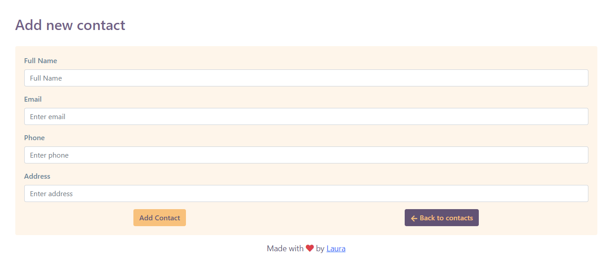
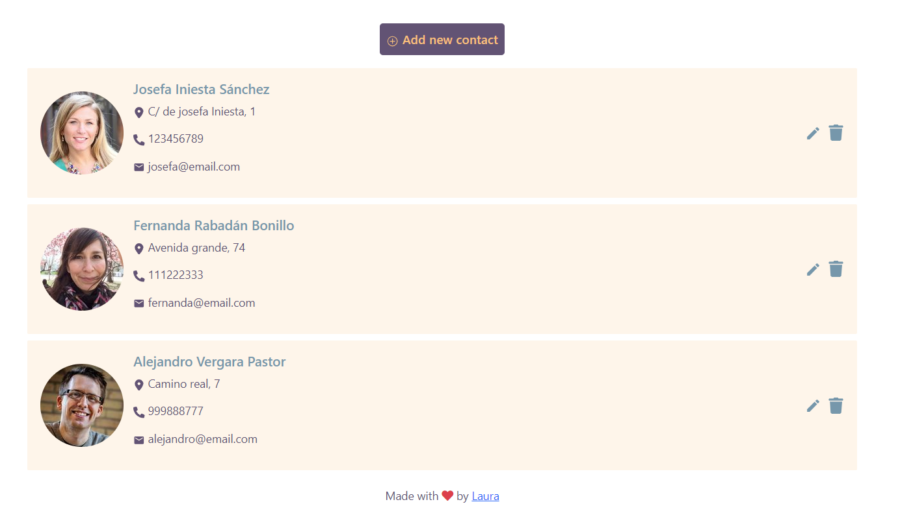
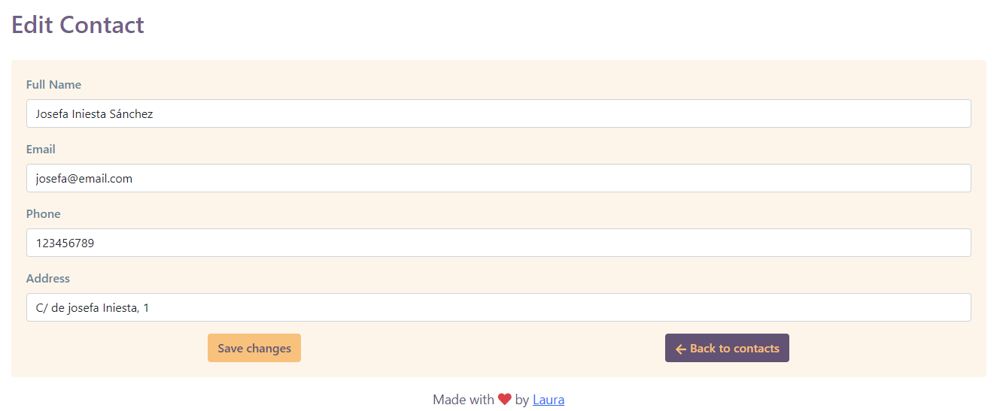

# Aplicación de Gestión de Contactos

Este proyecto es una **aplicación basada en React** diseñada para gestionar contactos. Permite a los usuarios ver contactos existentes, agregar nuevos contactos, editar los existentes y eliminar contactos. La aplicación obtiene datos de una API para mostrar la información de contacto y utiliza diversos hooks y contexto de React para gestionar el estado y las acciones.

  
  
  

### Características:
* **Ver Contactos**: Muestra una lista de contactos obtenidos desde una API.
* **Agregar Nuevo Contacto**: Permite agregar nuevos contactos con detalles como nombre, correo electrónico, teléfono y dirección.
* **Editar Contacto**: Permite editar los detalles de un contacto existente.
* **Eliminar Contacto**: Elimina un contacto de la lista.
* **Manejo de Errores**: Gestiona errores, como al obtener contactos o al crear una nueva agenda si esta no existe.
* **Interfaz Dinámica**: Utiliza React Router para la navegación entre diferentes vistas y actualiza la interfaz de usuario según las acciones del usuario.
* **Imagen Aleatoria de Usuario**: Obtiene una imagen aleatoria de usuario desde una API externa y la muestra junto con la información del contacto.

### Tecnologías Utilizadas:
* **React**: Biblioteca frontend para construir interfaces de usuario.
* **React Router**: Para gestionar la navegación entre vistas.
* **Context API**: Gestiona el estado global para compartir datos entre componentes de React.
* **Fetch API**: Maneja las solicitudes HTTP para interactuar con la API backend.
* **Iconos**: Utiliza bibliotecas populares de iconos como React Icons para elementos de interfaz de usuario.

### Cómo Usar:
1. **Clonar el Repositorio**: Clona el repositorio en tu máquina local.
2. **Instalar Dependencias**: Ejecuta `npm install` para instalar todas las dependencias requeridas.
3. **Iniciar el Servidor de Desarrollo**: Usa `npm run start` para ejecutar la aplicación en modo de desarrollo.
4. **Explorar la Aplicación**: Navega por la aplicación para ver, agregar, editar y eliminar contactos.

### Contribuciones
Las contribuciones son bienvenidas. Si deseas contribuir a este proyecto, por favor sigue estos pasos:
1. Haz un fork del repositorio.
2. Crea una rama para tu funcionalidad o corrección de errores.
3. Envía un pull request con una descripción clara de los cambios.
